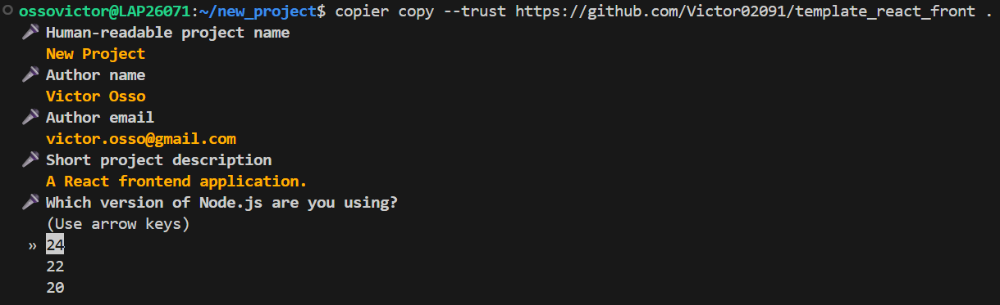
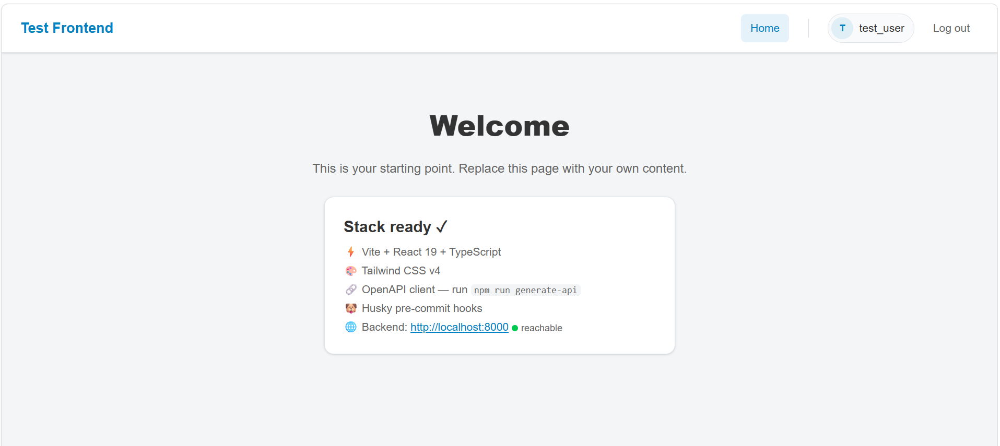

# Modern React Frontend Template

A production-ready React frontend project template powered by **Vite**.

This template provides a batteries-included setup with modern tooling, strict linting, automatic formatting, and CI/CD integration, all configured to work out of the box.

It is designed to work seamlessly with the [backend template](https://github.com/Victor02091/template_python_fastapi) for a complete full-stack setup.

Use this template : 

    copier copy --trust https://github.com/Victor02091/template_react_front .

<p align="center">
  
</p>

## 📂 Project Structure

The template generates a clean frontend layout:

```text
your-project/
├── src/
│   ├── assets/               # Static assets (images, fonts, etc.)
│   ├── client/               # Auto-generated OpenAPI client
│   ├── components/           # Shared components
│   ├── hooks/                # Custom hooks (e.g. OIDC interceptor)
│   ├── pages/                # Feature pages
│   ├── env.ts                # Runtime environment access
│   ├── App.tsx               # App root / routing
│   └── main.tsx              # Application entrypoint
├── public/
│   ├── env.js                # Local runtime values
│   └── env.template.js       # Template used by Docker startup
├── .husky/                   # Git hooks
├── .vscode/                  # Editor settings + extension recommendations
├── Dockerfile
├── nginx.conf
├── openapi-ts.config.ts
├── eslint.config.js
├── vite.config.ts
└── package.json
```

## ✨ Features

* **Framework:** [React](https://react.dev/) + [Vite](https://vite.dev/) + [TypeScript](https://www.typescriptlang.org/) with a production build pipeline.
* **Styling:** [Tailwind CSS v4](https://tailwindcss.com/).
* **API Client Generation:** [@hey-api/openapi-ts](https://heyapi.dev/openapi-ts) with generated fetch client, SDK, and TypeScript types.
* **Data Fetching:** [TanStack Query](https://tanstack.com/query/latest) pre-configured.
* **Routing:** [React Router](https://reactrouter.com/) pre-configured.
* **Authentication:** [OIDC](https://openid.net/connect/) integration via `react-oidc-context` with auto-injected token interceptors (optional).
* **Linter:** [ESLint](https://eslint.org/) with TypeScript + React rules.
* **Formatter:** [Prettier](https://prettier.io/) integrated with ESLint.
* **Pre-commit:** [Husky](https://typicode.github.io/husky/) + [lint-staged](https://github.com/lint-staged/lint-staged).
* **CI/CD:** CI pipelines for GitHub Actions, GitLab CI, or Bitbucket Pipelines (optional).
* **Containerization:** Production-ready Docker image (unprivileged Nginx + runtime env injection).
* **Editor:** VS Code settings and recommended extensions pre-configured.

## 📸 Preview



## 🛠️ Requirements

You **do not** need to install Python manually. The package manager **uv** can manage tooling installation.

You only need:
1. **Git**
2. **uv**
3. **Node.js** (includes **npm**)

### How to install uv

**On Linux / macOS:**

```bash
curl -LsSf https://astral.sh/uv/install.sh | sh
```

**On Windows:**

```powershell
powershell -ExecutionPolicy ByPass -c "irm https://astral.sh/uv/install.ps1 | iex"
```

More info on the [official website](https://docs.astral.sh/uv/getting-started/installation/#__tabbed_1_1).

## 📦 Installation

This template is built with **Copier**. You can install Copier globally using **uv** (recommended).

**Important:** This template uses custom extensions. You must install Copier with the `copier-template-extensions` plugin.

```bash
uv tool install copier --with copier-template-extensions
```

## 🚀 Usage

**Prerequisites:**
1. Create a new repository (or folder) and open it in your terminal.
2. **Ensure the folder is completely empty** (except for the `.git` folder if you cloned a new repository).

Run the generation command inside your empty folder:

```bash
copier copy --trust https://github.com/Victor02091/template_react_front .
```

### Update values of an existing project

If you have already generated a project and want to change current values (for example, the Node.js version):

```bash
copier update --vcs-ref=:current: --trust --defaults --data node_version="24"
```

### Update template of an existing project

If you have already generated a project and want to pull the latest updates from the template:

```bash
copier update --trust
```

## 📋 Template Parameters

During generation, Copier will ask you a series of questions. Here is a quick reference for what each parameter controls:

### General Settings
* **`project_name`**: The human-readable name of your project. Auto-slugified for the `package.json` name field and Docker image tags. *(Default: Current folder name)*
* **`description`**: A short summary of what the project does. Injected into the generated `README.md`. *(Default: "A React frontend application.")*
* **`author_name`** & **`author_email`**: Documentation metadata injected into the README. *(Default: Your global git config)*
* **`node_version`**: Pins the Node.js version across the stack (`.node-version`, Dockerfile, and CI/CD pipelines). *(Choices: 20, 22, 24 | Default: 24)*
* **`backend_url`**: The local URL of your backend API. Used at runtime (`env.js`) and by the OpenAPI client generator to fetch your schema. *(Default: `http://localhost:8000`)*

### Tooling & CI/CD
* **`add_ci`**: Generates a CI pipeline workflow that runs `npm run lint` and `npm run build` on every push. *(Default: true)*
* **`ci_provider`**: Selects the target CI platform (`Github Actions`, `GitLab CI`, or `Bitbucket Pipelines`). *(Condition: `add_ci` is true)*
* **`install_dependencies`**: Automatically runs `npm install` and formats the codebase immediately after generation. *(Default: true)*

### Authentication (OIDC)
* **`use_oidc`**: Protects the frontend with OpenID Connect. Adds the auth UI components, token interceptor hooks for API calls, and injects runtime environment variables. *(Default: true)*
* **`oidc_provider`**: *(Condition: `use_oidc` is true)*
  * `Local Keycloak`: Configures the app to point to the backend's local Keycloak container. Ideal for local development (ships with mock users).
  * `External IdP`: Skips Keycloak and points the app directly to an existing provider (Okta, Auth0, Azure AD, Cognito, etc.).
* **`oidc_client_id`**: The OAuth 2.0 Client/App ID from your external provider. Used by the auth context to identify the frontend during login. *(Condition: External IdP is selected | Default: `my-react-spa`)*
* **`oidc_authority`**: The issuer URL (e.g., `https://your-tenant.auth0.com/`) used to discover the authorization endpoints and verify tokens. *(Condition: External IdP is selected | Default: `https://your-idp.com/oauth2/default`)*